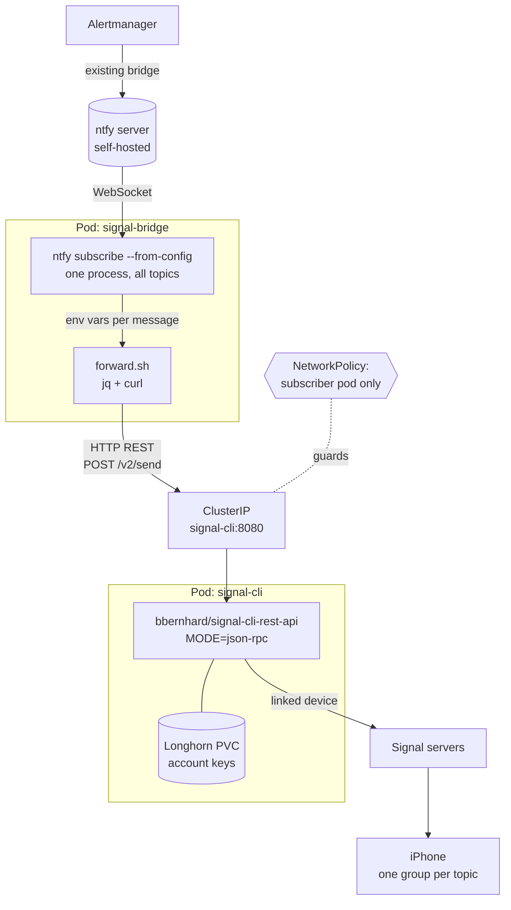

# PRD — Signal bridge

**Working name:** `signal-bridge`
**Status:** Draft
**Date:** 2026-08-22
**Writing style:** ASD-STE100

---

## Names used in this document

| Name | Meaning |
|---|---|
| the Alertmanager bridge | The existing service that sends Alertmanager alerts to ntfy. Out of scope. |
| the Signal bridge | The new service. Both pods together. |
| the subscriber | Pod 1. Runs the ntfy CLI and the forward script. |
| the signal daemon | Pod 2. Runs signal-cli in daemon mode. |
| forward | To move a message from ntfy to Signal. |
| send | The JSON-RPC method that signal-cli provides. |

---

## 1. Problem

The homelab runs an Alertmanager bridge. Alerts reach the self-hosted ntfy server. Delivery stops at that point.

The ntfy phone app is not installed. No alert reaches a phone today.

Three constraints apply to any solution:

1. Do not use the public ntfy.sh service.
2. Do not add a Cloudflare tunnel or any new public endpoint.
3. Do not add a cloud dependency that the homelab does not already have.

Signal satisfies all three constraints. The Signal app is already installed on the phone. Signal already delivers messages in the background. The Signal servers are an existing dependency.

**Volume.** The homelab produces tens of alerts each day. Peak volume stays below a few hundred each day. Volume is not a design driver. The design must stay simple, not scale.

---

## 2. Goal and non-goals

### Goal

The Signal bridge forwards ntfy messages to Signal. Alerts then reach the phone through the Signal app.

The bridge runs on the existing k3s cluster. The bridge adds no public endpoint. The bridge adds no new cloud account.

### In scope

1. Subscribe to one or more topics on the self-hosted ntfy server.
2. Format each message as plain text.
3. Forward each message to a Signal group.
4. Filter messages by priority or by tag.

### Non-goals

The bridge does not do these things:

1. Receive replies from Signal. The bridge sends in one direction only.
2. Forward to Telegram or to WhatsApp. Section 4 keeps this option open. Version 1 does not build it.
3. Forward attachments or ntfy click actions.
4. Replace the Alertmanager bridge. That service stays as it is.
5. Serve more than one person.
6. Scale. Volume stays in the low hundreds of messages each day.

---

## 3. Feasibility

### Confirmed

1. The ntfy CLI reads a `subscribe:` block from `client.yml`. The CLI holds many subscriptions in one process.
2. Each subscription entry takes its own command. Each entry also takes an `if:` filter on priority and tags.
3. The CLI passes message fields to the command as environment variables. The variables include `NTFY_MESSAGE`, `NTFY_TITLE`, `NTFY_PRIORITY`, `NTFY_TAGS`, `NTFY_TOPIC`, and `NTFY_RAW`.
4. signal-cli in daemon mode accepts JSON-RPC over HTTP. A POST to `/api/v1/rpc` with the `send` method delivers a message.
5. The daemon supports a device link through the `startLink` and `finishLink` methods. The phone keeps the number.

### Constraints

1. signal-cli ships pre-compiled libsignal binaries for x86_64 Linux, Windows, and macOS only. Other platforms need a compiled library. Pin the signal daemon to an x-large node.
2. A signal-cli release older than three months can stop working. Official clients expire, and the server can then change the protocol. Plan for regular upgrades.
3. The JSON-RPC endpoint has no authentication. Any process that reaches the port sends messages as the account. Restrict access with a NetworkPolicy.
4. The Signal protocol expects a client to receive messages regularly. This keeps encryption efficient and delivers group updates. Daemon mode receives automatically. Do not use one-shot sends.

### Unverified

Group notification behaviour on the phone. M0 tests this first. A negative result needs a different delivery target.

---

## 4. Architecture

### Overview

The Signal bridge has two pods. Each pod does one job. The pods communicate over a ClusterIP service.



### Pod 1: the subscriber

The image holds three binaries: `ntfy`, `jq`, and `curl`. The base is Alpine. The image stays under 30 MB.

The pod is stateless. A restart loses no data. The pod mounts `client.yml` from a Secret.

The pod prefers nodes labelled `node_size=small` and avoids `node_size=large` and `node_size=x-large`. The pod has no architecture constraint.

### Pod 2: the signal daemon

The image is `bbernhard/signal-cli-rest-api`. Run with `MODE=json-rpc` for daemon operation. The container runs a JVM.

The pod mounts a Longhorn PVC. The PVC holds the account keys. A lost PVC needs a new device link.

The pod runs on a node labelled `node_size=x-large`. Use a `nodeSelector` for that label. An x-large node is an Intel machine with Longhorn volumes. The bundled libsignal binary runs on Intel. No ARM build is needed.

The pod uses the `Recreate` strategy. The PVC is ReadWriteOnce. Two replicas would corrupt the session.

### Message path

1. A publisher sends a message to a topic on the ntfy server.
2. The ntfy CLI receives the message over the WebSocket connection.
3. The CLI checks the `if:` filter for that topic. The CLI drops the message if the filter fails.
4. The CLI runs `forward.sh`. The CLI sets the message fields as environment variables.
5. The script builds a REST request body with `jq`.
6. The script POSTs to the `/v2/send` endpoint on the ClusterIP service.
7. The daemon sends the message to the Signal group.
8. The phone shows the message in that group.

### Service address

Both pods run in the `ntfy` namespace. The short name works from the subscriber:

```
http://signal-cli:8080/v2/send
```

The full name is `signal-cli.ntfy.svc.cluster.local`. A ClusterIP service resolves inside the cluster only. Nothing outside the cluster reaches this port.

### Topic to group mapping

One ntfy topic maps to one Signal group. The map lives in `client.yml`. The group ID is the first argument to the script.

```yaml
default-host: https://ntfy.houli.eu
subscribe:
  - topic: alertmanager
    command: '/opt/forward.sh "$GROUP_ALERTMANAGER"'
    if:
      priority: high,urgent
  - topic: backups
    command: '/opt/forward.sh "$GROUP_BACKUPS"'
```

Add a topic with a config change and a pod restart.

### Extension point

The script is the only component that knows about Signal. A Telegram target needs a second script and a second target variable. The subscriber pod does not change. This keeps non-goal 2 cheap to reverse.

---

## 5. Features

### From the ntfy CLI

- Subscribes to many topics in one process.
- Reconnects after a lost connection.
- Filters each topic by priority and by tag, through the `if:` block.
- Runs a command for each message that passes the filter.
- Passes message fields to the command as environment variables.
- Authenticates to the ntfy server with a token.

### From the forward script

- Builds a JSON-RPC request with `jq`. `jq` escapes the message text correctly.
- Reads the target group ID from its first argument.
- Reads the account number from the environment.
- Sends the request with `curl`. `curl -f` fails on an HTTP error.
- Retries a failed send three times, with a growing delay.
- Writes one log line for each message. The line holds the ntfy message ID, the topic, and the result.
- Never writes the token or the account number to the log.

### From the signal daemon

- Holds one JVM. One JVM answers all requests.
- Receives messages continuously. This keeps the Signal session healthy.
- Stores the account keys on the PVC.

### From Kubernetes

- Restarts either pod after a crash.
- Restricts the JSON-RPC port to the subscriber pod, through a NetworkPolicy.
- Supplies the token, the account number, and the group IDs from a Secret.
- Keeps the daemon on one node, through the `node_size` label.

### Known gaps

- A subscriber restart loses messages published during the outage. The CLI does not replay them.
- The bridge exports no metrics. Logs are the only signal.
- A message that fails three sends is dropped. The log records the drop.

---

## 6. Non-functional requirements

### Performance

- A message reaches the phone within 5 seconds of publication, in the normal case.
- The bridge handles a burst of 20 messages in one minute without a dropped message.
- Volume stays below a few hundred messages each day. No requirement scales above that.

### Resources

- The signal daemon container gets a 768 MiB memory limit. A JVM needs the headroom.
- The subscriber container gets a 64 MiB memory limit.
- Set a memory request on both containers. A separate limit makes the daemon memory use readable in Grafana, apart from the existing node memory issue.

### Availability

- One replica of each pod is enough.
- A restart is an acceptable recovery for any fault.
- The bridge tolerates an ntfy outage. The CLI reconnects on its own.

### Startup

- Both pods reach a running state within 60 seconds.
- The subscriber tolerates a daemon that is not yet ready. The send retry covers the gap.

### Security

- The JSON-RPC port is never reachable outside the cluster.
- A NetworkPolicy allows ingress to the daemon from the subscriber pod only.
- The token, the account number, and the group IDs live in a Kubernetes Secret. Ansible Vault holds the source values.
- No secret appears in a log line, in git, or in a ConfigMap.

### Data

- The PVC holds the account keys. Its loss needs a new device link.
- The PVC uses the `Retain` reclaim policy.
- The Longhorn backup target includes the PVC.
- Take a PVC snapshot before each signal-cli upgrade.

### Maintainability

- The forward script stays under 50 lines.
- A new topic needs a config change and a pod restart. Nothing else.
- signal-cli gets an upgrade at least every three months.

---

## 7. Deployment

### Method

Ansible applies plain manifests. The project builds no Helm chart. A chart adds a pipeline that this project does not need.

Reuse an upstream image where one exists. Build an image only for the subscriber.

### Namespace

Both pods run in the `ntfy` namespace, beside the ntfy server.

The Secret then sits in the same namespace as the ntfy server. Section 9 records this trade-off.

### Objects

| Object | Name | Purpose |
|---|---|---|
| Deployment | `signal-cli` | Runs the signal daemon |
| Deployment | `signal-bridge` | Runs the ntfy CLI and the forward script |
| Service | `signal-cli` | ClusterIP on port 3000 |
| PersistentVolumeClaim | `signal-cli-data` | Holds the account keys |
| Secret | `signal-bridge-config` | Holds `client.yml`, the account number, and the group IDs |
| NetworkPolicy | `signal-cli-ingress` | Allows ingress from the subscriber pod only |

### Deployment settings

The `signal-cli` Deployment uses these settings:

- `nodeSelector: node_size=x-large`
- `strategy: Recreate`
- One replica
- The PVC mounted at the signal-cli data path
- No `hostPort`, no Ingress

The `signal-bridge` Deployment uses these settings:

- One replica
- The Secret mounted at the ntfy config path
- No PVC
- No `hostPort`, no Ingress

### Storage

The PVC uses the Longhorn storage class. The size is 1 GiB. The reclaim policy is `Retain`.

Add the PVC to the Longhorn NFS backup target after the first successful send.

### Secrets

Ansible Vault holds the source values. An Ansible template renders `client.yml`. The role creates the Secret from the rendered file.

The repository holds the template. The repository holds no rendered file and no vault plaintext.

### Order of work

1. Create the namespace objects for storage and secrets.
2. Deploy `signal-cli`.
3. Link the device. Section 8 gives the procedure.
4. Confirm one manual send.
5. Deploy `signal-bridge`.
6. Apply the NetworkPolicy.
7. Publish a test message to a topic.

### Upgrades

1. Snapshot the `signal-cli-data` PVC in Longhorn.
2. Update `signal_cli_image_tag` in `infra/roles/signal_bridge/defaults/main.yaml`.
3. Run Ansible:
   ```
   ansible-playbook infra/playbooks/observability.yaml --tags signal-bridge
   ```
4. Send a test message and confirm it arrives in the Signal group.

A failed upgrade: revert `signal_cli_image_tag` and re-run Ansible. A corrupted session: restore the PVC snapshot from Longhorn and re-run Ansible.

---

## 7.1 Image build

### The subscriber image

The subscriber needs three binaries: `ntfy`, `jq`, and `curl`. The official ntfy image holds the ntfy binary only. A custom image is therefore necessary.

```dockerfile
FROM alpine:3.20
COPY --from=binwiederhier/ntfy:v2.11.0 /usr/bin/ntfy /usr/bin/ntfy
RUN apk add --no-cache jq curl bash
COPY forward.sh /opt/forward.sh
ENTRYPOINT ["ntfy", "subscribe", "--from-config"]
```

The multi-stage copy pins the ntfy version to a tag.

### The image repository

A separate repository holds the image. The repository holds four files:

1. `Dockerfile`
2. `forward.sh`
3. `Jenkinsfile`
4. `README.md`

The deploy repository holds the manifests. The deploy repository holds no Dockerfile. The two repositories have different change rates.

### The build

Jenkins builds the image. The existing DinD sidecar does the build. The pattern follows `arr-exporter`.

### The registry

Jenkins pushes the image to Docker Hub. The path is `rhoulihan/nfty-signal-bridge`.

The cluster pulls from Docker Hub. No `imagePullSecret` is needed for a public image.

### Tags

Each build gets a version tag. Use the short git SHA, or a semantic version.

Never deploy the `latest` tag. A version tag makes a rollback possible.

The Deployment references one exact tag. An upgrade changes that tag.

---

## 8. Registration procedure

The device link runs once. Run every step from the laptop.

Do not register the number. Registration removes the number from the phone. Link the daemon as a secondary device instead.

### Prepare

1. Confirm that the `signal-cli` Deployment runs.
2. Confirm that the PVC mounts at the signal-cli data path.
3. Open a port-forward to the daemon:

```
kubectl -n ntfy port-forward deploy/signal-cli 8080:8080
```

A port-forward goes through the API server. The NetworkPolicy needs no change.

### Link

1. Open a browser on the laptop and navigate to:

```
http://localhost:8080/v1/qrcodelink?device_name=signal-bridge
```

The page displays a QR code.

2. Open Signal on the iPhone. Open **Settings**, then **Linked devices**, then **Link New Device**.
3. Scan the QR code on the laptop screen.
4. Confirm that the iPhone lists a device named `signal-bridge`.

The QR code is a linking credential. Anyone who scans it first gains a device on the account. Do not share the screen or the URL during this step.

### Verify and record

1. Send one test message through the port-forward:

```
curl -s -X POST \
  -H 'content-type: application/json' \
  -d '{"message":"test","number":"<account>","recipients":["<group-id>"]}' \
  http://127.0.0.1:8080/v2/send
```

2. Confirm that the message arrives on the phone.
3. List the groups and read each group ID:

```
curl -s http://127.0.0.1:8080/v1/groups/<account> | jq '.[] | {id, name}'
```

If a newly created group does not appear, trigger a receive first:

```
curl -s http://127.0.0.1:8080/v1/receive/<account>
```
4. Store each group ID in Ansible Vault.
5. Close the port-forward.
6. Add the PVC to the Longhorn backup target.
7. Take a first PVC snapshot.

### Group setup

Create one Signal group for each ntfy topic. Create the groups on the phone.

The daemon shares the account. The account membership covers the daemon.

### Recover

A lost PVC needs a new link. Delete the stale device on the iPhone first. Then repeat this procedure. The group IDs stay valid.

---

## 9. Risks

| # | Risk | Effect | Mitigation |
|---|---|---|---|
| 1 | A signal-cli release older than three months can stop working. | The bridge stops. Alerts stop. | Upgrade every three months. Treat the upgrade as routine work. |
| 2 | The bridge fails without a visible sign. | Silence looks the same as a quiet week. | Publish a daily heartbeat message to one topic. Alert on a stale forward count. Route that alert through a second path. |
| 3 | The PVC is lost. | The account keys are gone. The daemon cannot send. | Keep the PVC on the Longhorn backup target. Snapshot before each upgrade. Follow section 8 to link again. |
| 4 | The JSON-RPC port has no authentication. | Another workload sends Signal messages as the account holder. | Restrict ingress to the subscriber pod with a NetworkPolicy. Expose no Ingress and no hostPort. |
| 5 | A group message from a linked device raises no notification on the phone. | The bridge delivers, but the phone stays quiet. | Verified in M0: group messages from a linked device raise notifications on the iPhone. Risk closed. |
| 6 | The Secret sits in the `ntfy` namespace. | Anything that reads secrets in that namespace sends as the account. | Accept for a single-operator cluster. Revisit if the cluster gains other users. |
| 7 | The subscriber restarts. | Messages published during the outage never arrive. | Accept for version 1. The CLI does not replay. Section 12 holds the fix. |
| 8 | An alert storm floods a group. | The phone becomes unusable. Alerts lose value. | Filter on priority in `client.yml`. Add a rate limit to the script if a storm happens. |
| 9 | signal-cli is unofficial software. Signal does not support automated sending. | The account gets a restriction. | Keep volume low. Send to groups only. Accept the risk. |
| 10 | The bbernhard REST API endpoint paths differ from the native signal-cli JSON-RPC paths. | The link and send procedures fail. | Verified in M0: bbernhard uses its own REST API. Section 8 updated to reflect confirmed endpoints. Risk closed. |

### Accepted without mitigation

- The bridge depends on Docker Hub for image pulls.
- The bridge depends on the Signal servers.
- A message that fails three sends is dropped.

---

## 10. Milestones

### M0 — Verify

M0 answers four questions. A wrong answer changes the design, so M0 runs before any other work.

1. Does a group message from a linked device raise a notification on the iPhone?
2. What are the exact `startLink` and `finishLink` parameters?
3. Can a Signal group hold one member?
4. Does the daemon start in multi-account mode without an account?

Run signal-cli locally with Docker. Link a device. Create one test group. Send one message. Watch the phone.

**Exit test:** a message sent from the laptop appears as a notification on the iPhone.

### M1 — Image

Build the subscriber image. Push it to GHCR.

**Exit test:** the cluster pulls the image and the pod starts.

### M2 — Forward one topic

Write `forward.sh`. Deploy both pods. Configure one topic and one group.

**Exit test:** a message published to that topic appears in that group within 5 seconds.

### M3 — Harden

Add the send retry. Add the log line. Add the NetworkPolicy. Move all values into the Secret.

**Exit test:** a stopped daemon produces three retries and one error log line, and the subscriber keeps running.

### M4 — All topics

Add the remaining topics and groups. Add the priority filters. Point the Alertmanager bridge output at a forwarded topic.

**Exit test:** a real Alertmanager alert reaches the correct group.

### M5 — Operate

Add the heartbeat message. Add the stale-forward alert. Add the PVC to the backup target. Write the README, including section 8.

**Exit test:** a stopped subscriber raises an alert within one hour.

### M6 — Telegram (optional)

Write a second forward script for the Telegram Bot API. Change one `command:` line.

**Exit test:** one topic delivers to Telegram, and the other topics keep delivering to Signal.

---

## 11. Acceptance criteria

The bridge is complete when all of these tests pass.

1. A message published to a configured topic appears in the mapped Signal group within 5 seconds.
2. The phone raises a notification for that message.
3. A message below the configured priority never reaches Signal.
4. A restarted subscriber pod forwards the next published message.
5. A stopped daemon produces retries and a log line, and the subscriber survives.
6. A request to the JSON-RPC port from another namespace fails.
7. No log line holds the token, the account number, or the message body of a filtered message.
8. The git repositories hold no secret.
9. A deleted and reapplied Deployment needs no new device link.
10. A new topic needs one config change and one pod restart.

---

## 12. Open questions

1. Which topics get forwarded? Forwarding everything rebuilds the noise problem inside Signal.
2. Which priority threshold suits each topic? A single threshold may be enough at first.
3. Does the heartbeat belong on its own topic and its own group, or inside an existing group?
4. Should the subscriber record the last message ID and replay after a restart? This closes risk 7 and needs a state file and a PVC.
5. Does `forward.sh` stay a shell script? A Go binary removes `jq` and `curl`, and matches `arr-exporter`. A shell script stays readable.
6. Which upgrade cadence catches the three-month expiry? A monthly check is safer than a quarterly one.

---

## Sources

- ntfy subscribe CLI: https://docs.ntfy.sh/subscribe/cli/
- ntfy subscribe API: https://docs.ntfy.sh/subscribe/api/
- signal-cli: https://github.com/AsamK/signal-cli
- signal-cli JSON-RPC man page: https://github.com/AsamK/signal-cli/blob/master/man/signal-cli-jsonrpc.5.adoc
- signal-cli native library wiki: https://github.com/AsamK/signal-cli/wiki/Provide-native-lib-for-libsignal
- signal-cli-rest-api: https://github.com/bbernhard/signal-cli-rest-api
